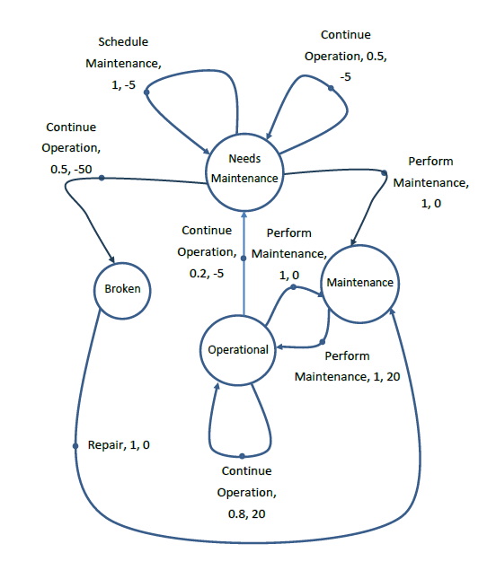
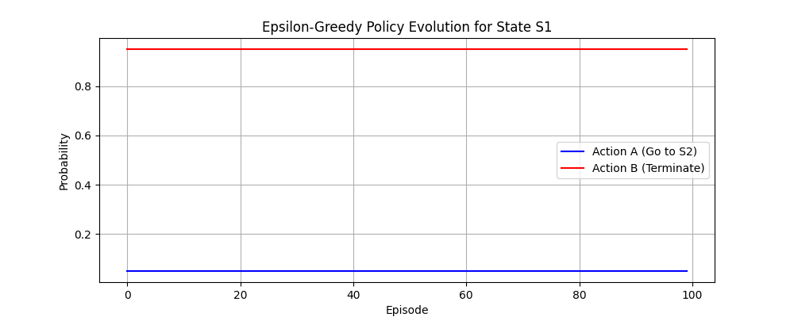

# 🤖 Reinforcement Learning Tutorials:🧠

# 1️⃣ MDP & Dynamic Programming Tutorial

Welcome to the **MDP_DP** folder! This section of the repository focuses on **Markov Decision Processes (MDPs)** **Bellman Optimality Equations** and **Dynamic Programming (DP)** techniques in Reinforcement Learning.

## 🏭 Warehouse Maintenance Optimization with MDPs & Dynamic Programming ⚙️



*Visualization of the warehouse maintenance MDP*

### 🔍 Problem Statement
**Task:** Optimize maintenance strategies for robotic systems in a warehouse using Reinforcement Learning.  
**Challenge:** Prevent robotic system failures while minimizing downtime through optimal maintenance scheduling.  
**Goal:** Find the policy that maximizes long-term rewards using **Markov Decision Processes (MDPs)** and **Dynamic Programming**.

---

### 📦 Environment Specification (MDP)

#### 🧩 States
| State | Symbol | Description | 
|-------|--------|-------------|
| Operational | 🟢 **O** | Robot functioning normally |
| Needs Maintenance | 🟡 **NM** | Early wear signs but operational |
| Maintenance | 🔵 **M** | Undergoing scheduled maintenance | 
| Broken | 🔴 **B** | Critical failure state |

#### 🎮 Actions
| Action | Symbol | Description |
|--------|--------|-------------|
| Perform Maintenance | PM | Proactive maintenance |
| Continue Operation | CO | No intervention |
| Schedule Maintenance | SM | Plan future maintenance |
| Repair | R | Fix broken robot |

---

## ⚡ Key Features
```python
# Highlighted code feature: Stochastic transitions
def get_transitions(state, action):
    if state == "NM" and action == "CO":
        # 50% chance breakdown, 50% stay degraded
        return [('B', 0.5), ('NM', 0.5)]
```

🌐 Environment Dynamics
|State	|Action	|Transitions	|Reward|
|-------|-------|---------------|------|
|🟢 O	|CO	|80% stay O, 20% → 🟡 NM	|+20 if stays O|
|🟡 NM	|PM	|100% → 🔵 M	|0|
|🔵 M	|SM	|100% → 🟢 O	|+20|
|🔴 B	|R	|100% → 🟢 O	|+20|

⛔Note: The Environment Dynamics is not fully written here you can refer for it from the code 

---

## 🗂️ Folder Contents
Explore algorithms and implementations for solving MDPs using DP methods:
- **Policy Iteration** 🔄
- **Value Iteration** ⚡
- **Policy Evaluation** 📊

### 📜 Code Files:
| File | Description |
|------|-------------|
| [`policy_iteration.py`](./MDP_DP/policy_iteration.py) | Policy Iteration algorithm implementation |
| [`value_iteration.py`](./MDP_DP/value_iteration.py) | Value Iteration algorithm implementation |
| [`Lecture_3_PolicyEval.py`](./MDP_DP/Lecture_3_PolicyEval.py) | Policy Evaluation demonstration | 

---

# 2️⃣ Monte Carlo & MDP
## Epsilon-Greedy Monte Carlo Control for a Simple MDP

[](https://www.python.org/)
[](https://matplotlib.org/)

This repository demonstrates **Epsilon-Greedy Monte Carlo Control** for solving a simple Markov Decision Process (MDP). The agent learns to maximize cumulative rewards in a deterministic environment while balancing exploration and exploitation using an ε-soft policy.

---

### Problem Description
The agent starts in state `S1` and must learn the optimal path to a terminal state, choosing between:
1. A **short-term reward** (immediate termination with +2 reward).
2. A **long-term reward** (transitioning to an intermediate state `S2` for +5 reward, then terminating with +10 reward).

The goal is to learn a policy that maximizes total undiscounted rewards (\( \gamma = 1 \)).

---

### Environment Setup
#### States
- `S1`: Initial state.
- `S2`: Intermediate state.
- `Terminal`: Absorbing state (episode ends).

#### Actions & Transitions
| State     | Actions | Next State | Reward |
|-----------|---------|------------|--------|
| `S1`      | `A`     | `S2`       | +5     |
| `S1`      | `B`     | `Terminal` | +2     |
| `S2`      | `C`     | `Terminal` | +10    |

---

### Algorithm: Epsilon-Greedy Monte Carlo Control
1. **Initialization**:
   - Q-values for all state-action pairs start at 0.
   - Policy starts as ε-soft (50% probability for actions A/B in `S1`).
2. **Training**:
   - Generates 100 episodes using the current policy.
   - Processes episodes backward to compute returns (**first-visit MC**).
   - Updates Q-values incrementally using observed returns.
   - Adjusts the policy to balance exploration (ε = 0.1) and exploitation.
3. **Policy Update**:
   - **95% probability** for the best action (exploitation).
   - **5% probability** for other actions (exploration).

---

### Key Features
- **Model-Free RL**: Learns directly from episodic experience.
- **Exploration-Exploitation**: ε-greedy strategy ensures robustness.
- **First-Visit MC**: Updates Q-values only for the first occurrence of state-action pairs.
- **Visualization**: Tracks policy evolution over episodes.

---

### Results
#### Expected Q-Values
| State-Action | Q-Value |
|--------------|---------|
| `(S1, A)`    | 15.00   |
| `(S1, B)`    | 2.00    |
| `(S2, C)`    | 10.00   |

#### Final Policy for `S1`
- **Action A (Go to S2)**: 95.0%
- **Action B (Terminate)**: 5.0%

---

### Visualization
 
*The plot shows the probability of choosing actions A/B in `S1` over 100 episodes, converging to 95% for the optimal action (A).*

---

# 3️⃣ TD Learning (SARSA & Q-Learning)

## Project Description

This project demonstrates how **Temporal Difference (TD) learning** methods (SARSA and Q-Learning) can solve a gridworld maze:
- The maze is a 10x10 grid with:
  - **Start position** (green)
  - **Goal position** (red)
  - **Walls** (black)
- The agent learns to navigate from start to goal by maximizing cumulative rewards while avoiding walls.
- Includes visualization of:
  - Learning progression (steps per episode)
  - Optimal paths at different training stages
  - Final policy

---

## Features

- **Maze Configuration**:
  - Predefined 10x10 layout with walls, start, and goal
  - Customizable maze structure (`maze.py`)
- **Reinforcement Learning**:
  - SARSA (on-policy TD control)
  - Q-Learning (off-policy TD control)
- **Visualization**:
  - Maze grid with optimal path overlay
  - Learning curve (steps per episode)
  - Progressive path evolution during training
- **Hyperparameter Tuning**:
  - Adjust learning rate (`alpha`), discount factor (`gamma`), and exploration rate (`epsilon`)

---

## Installation

1. Clone the repository:
   ```bash
   git clone https://github.com/NabilHassan11/Reinforcement_Learning_Tuts.git
   cd SARSA_maze_code.py

---

## 🚀 Quick Start
### Prerequisites
- Python 3.8+
- NumPy (`pip install numpy`)
- matplotlib (`pip install numpy matplotlib`)

### Installation
```bash
git clone https://github.com/NabilHassan11/Reinforcement_Learning_Tuts.git
cd Reinforcement_Learning_Tuts/MDP_DP
